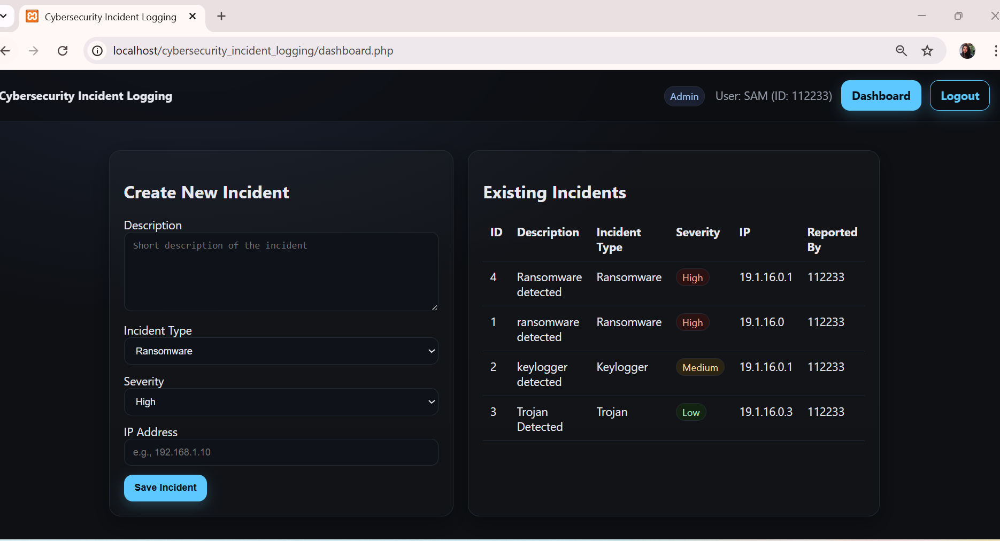
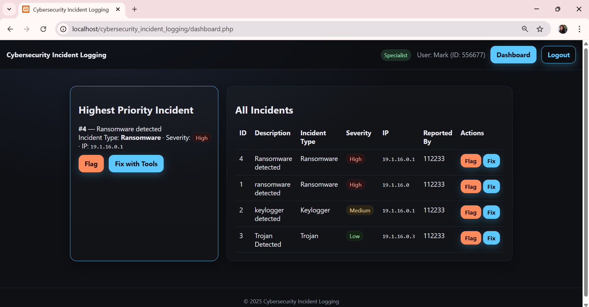
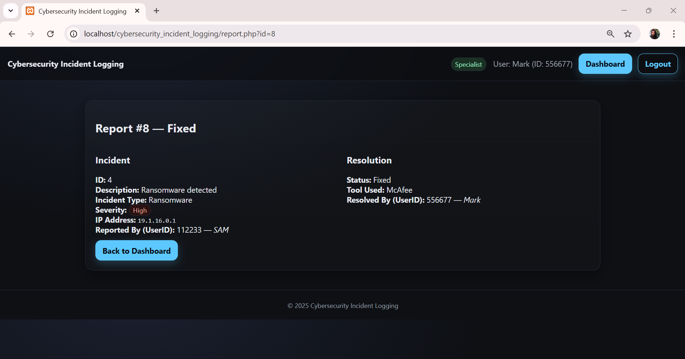
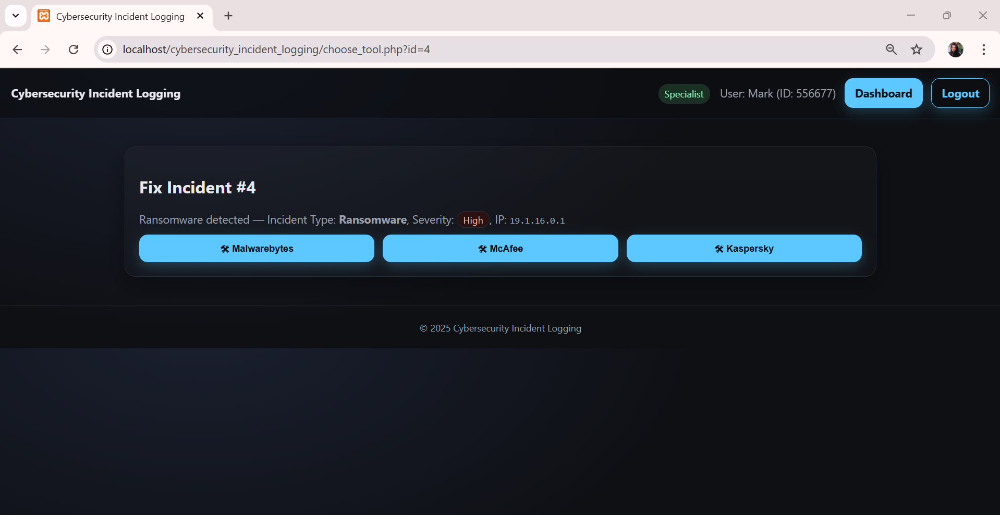

# CybersecurityIncidentLogging
# Cybersecurity Incident Logging Database Project 

This project is a **full-stack PHP + MySQL application** built with **XAMPP** that simulates how cybersecurity teams log, prioritize, and resolve incidents.  
It demonstrates **role-based access control**, incident logging, severity-based prioritization, tool-based remediation, and reporting.

---

##  Project Workflow
1. **Admin Role**
   - Logs cybersecurity incidents into the database.
   - Provides:
     - **Description** of the incident
     - **Incident Type** (Ransomware, Keylogger, Trojan, etc.)
     - **Severity** (High, Medium, Low)
     - **IP Address** of affected system
   - All incidents are stored and viewable in the Admin dashboard.

2. **Specialist Role**
   - Views incidents in **priority order** (High → Medium → Low).
   - Always sees the **highest-priority incident at the top**.
   - Can take actions:
     - **Flag Incident** → Marks it as needing review.
     - **Fix with Tools** → Resolves the incident using tools like:
       - Malwarebytes  
       - McAfee  
       - Kaspersky  
   - Actions automatically generate **reports** for accountability.

3. **Reports**
   - Each report links:
     - Incident details (type, severity, IP, etc.)
     - Resolution status (Flagged/Fixed)
     - Tool used (if fixed)
     - User who resolved it
   - Acts as a permanent record for incident handling.

---

## Frontend
- **HTML5 + CSS3** for structure and design.  
- Clean, **cybersecurity-themed UI** (dark tones, priority highlights).  
- Forms for **incident submission** and **tool selection**.  
- Tables for **incident queues** and **reports**.  
- Minimal but functional — designed for clarity, not flashy visuals.

---

##  Backend
- **PHP** handles:
  - Session management and role-based access (Admin vs Specialist).  
  - Secure database queries with **prepared statements**.  
  - Business logic for incident creation, prioritization, and reporting.  

- **MySQL Database** stores:
  - Users  
  - Incidents (with severity and IP address)  
  - Tools (Malwarebytes, McAfee, Kaspersky)  
  - Reports (incident resolution records)  

- **XAMPP** provides:
  - Apache web server for PHP execution.  
  - MySQL database engine.  

---

## 📑 Reports
- Each incident resolution produces a **report page**.  
- Shows:
  - Incident details (type, severity, IP, description)  
  - Resolution status (Flagged / Fixed)  
  - Tool used (if applicable)  
  - Specialist who resolved it  
- Ensures accountability and traceability of actions.  

---

###  Admin Dashboard
- Form to log new incidents  
- Table of existing incidents

###  Specialist Dashboard
- Highest-priority incident highlighted  
- Options to **Flag** or **Fix with Tools**

###  Report Page
- Detailed report of incident resolution

### Incident Fixing Page
- Specialists can view incidents sorted by highest priority  
- Option to select security tools such as **Malwarebytes**, **McAfee**, or **Kaspersky**  
- Once a tool is chosen, the incident is flagged as fixed and sent to the reporting system  

---

## Learning Outcomes
- Understand **role-based access control** in web apps.  
- Implement **incident management workflow** with priority handling.  
- Learn **PHP + MySQL integration** using prepared statements.  
- Build a **full-stack app** combining frontend forms, backend logic, and database storage.  
- Practice **cybersecurity concepts** like incident tracking, remediation tools, and accountability reports.  

---

##  Notes
- Designed for **academic / demonstration purposes**.  
- Runs locally on **XAMPP (Apache + MySQL + PHP)**.  
- No deployment intended.  
